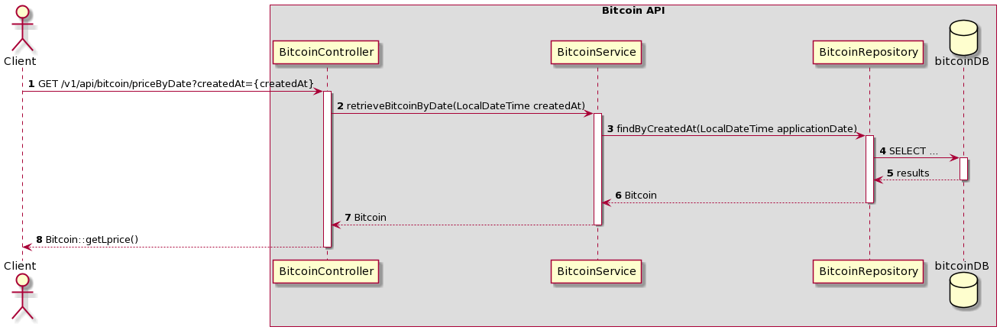
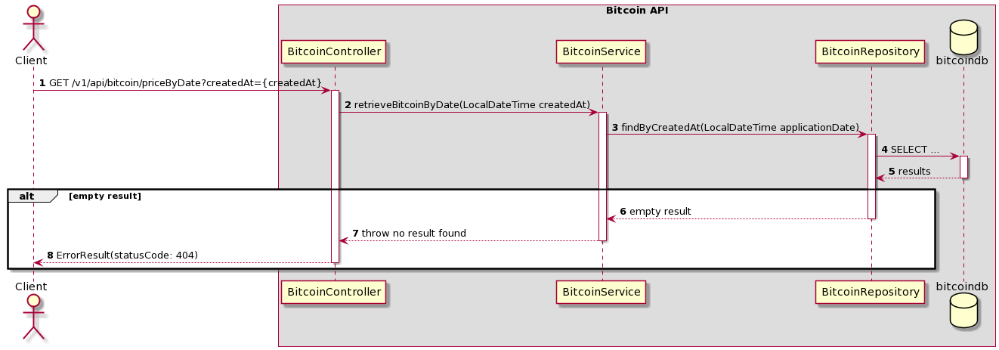
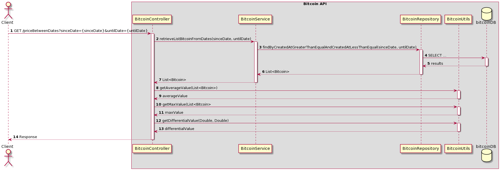
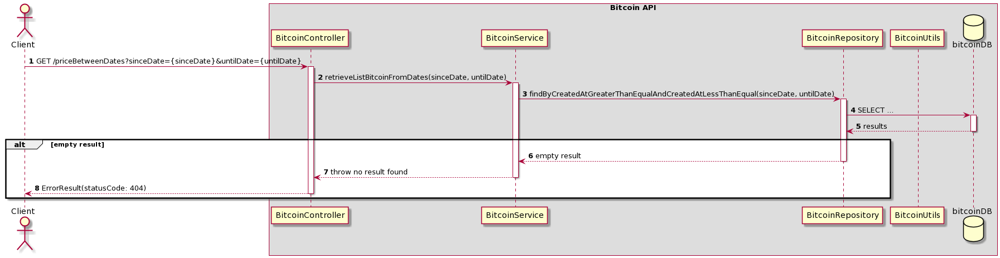

# Flows

The diagram shows the services used at different usecase of the bitcoin price API.

## GET Bitcoin price by a certain time

#### Retrieve the bitcoin price info ok - 200

1. The request to find a bitcoin price in a certain time is received.
2. Execute the service to find price by createdAt.
3. Request repository to execute select query with createdAt.
4. Execute select query with param
5. Retrieve result
6. Retrieve Bitcoin
7. Retrieve Bitcoin
8. Retrieve getLprice from Bitcoin

#### Bitcoin price cannot be found - 404

1. The request to find a bitcoin price in a certain time is received.
2. Execute the service to find price by createdAt.
3. Request repository to execute select query with createdAt.
4. Execute select query with param
5. Retrieve result empty
6. Retrieve return null
7. Retrieve throw ResourceNotFoundException
8. Retrieve a specific response to client with statusCode: 404

## GET Bitcoin average value and perceptual differential value by a certain lapse

1. The request to find a bitcoin price in a certain time is received.
2. Execute the service to find price by createdAt.
3. Request repository to execute select query with createdAt.
4. Execute select query with param
5. Retrieve result
6. Retrieve Bitcoin
7. Retrieve Bitcoin
8. Execute utils to get average value from Bitcoin
9. Retrieve Double value
10. Execute utils to get max value from Bitcoin
11. Retrieve Double value
12. Execute utils to get differential value from average and max values
13. Retrieve Double value
14. Retrieve Response with average and differential values

## GET Bitcoins not found between dates - 404

1. The request to find a bitcoin price in a certain time is received.
2. Execute the service to find price by createdAt.
3. Request repository to execute select query with createdAt.
4. Execute select query with param
5. Retrieve result
6. Retrieve return empty
7. Retrieve throw ResourceNotFoundException
8. Retrieve a specific response to client with statusCode: 404